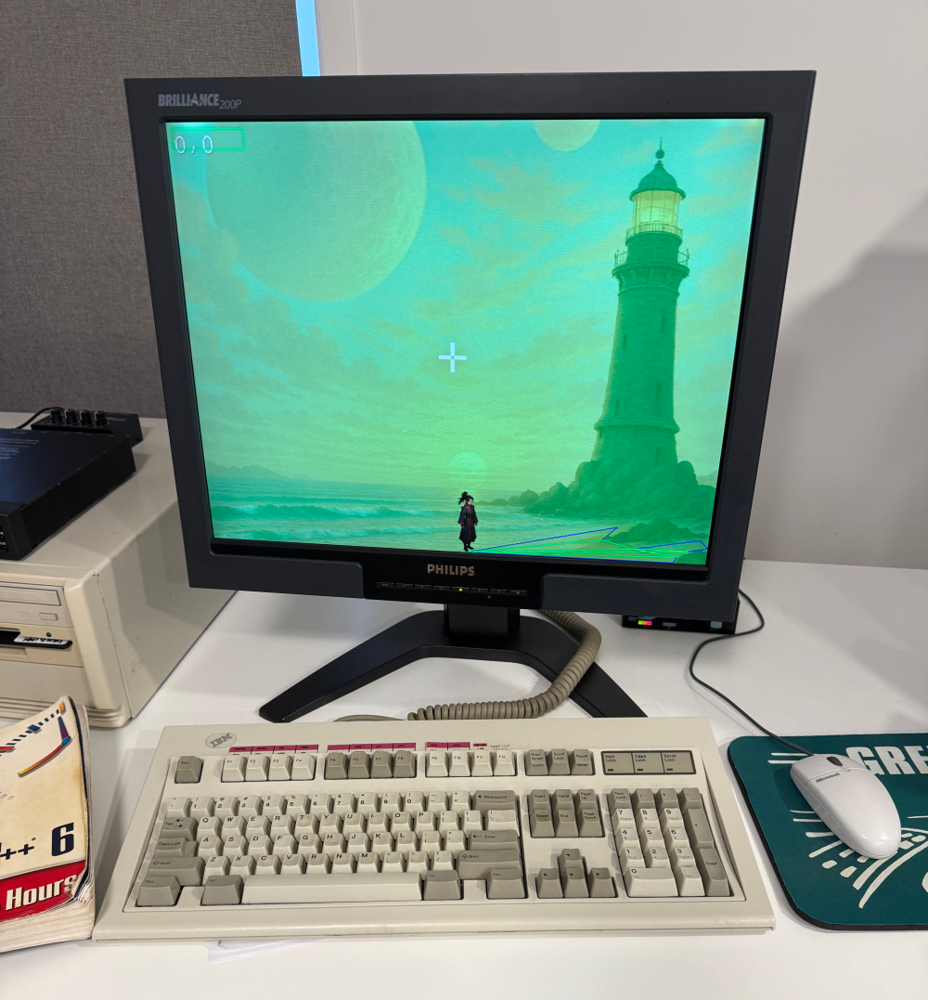

# Hatchet

### Write modern [Haxe](https://haxe.org). Run it on Windows 98.

**Hatchet transpiles Haxe 4.x to portable C++98** — source so old-school it builds under **Visual C++ 6.0** and runs on **Windows 9x** and vintage Unix toolchains. Develop on a 2026 machine with full Haxe tooling; ship a binary to a 1998 one.

[](LICENSE.md)
[](https://github.com/andrewglind/hatchet/releases)
[](https://www.rust-lang.org)
[](https://github.com/andrewglind/hatchet/wiki)



<p align="center"><em>Everything on screen — cursor, dialog box, actor, backdrop, walkbox, A&#42; pathfinding — is game logic written in Haxe and transpiled to C++98 by Hatchet, layered over a hand-written C++ engine. Built with Visual&nbsp;C++&nbsp;6.0, running on real period hardware. No emulator.</em></p>

> **Is this for you?**
> **Yes** — if you want to ship Haxe to retro or embedded targets that hxcpp can't reach.
> **No** — it's not a drop-in hxcpp replacement; it implements a focused subset of Haxe 4.x.

## Why?

hxcpp — Haxe's official C++ backend — can't target anything older than C++11. That has always
put Haxe out of reach for retro and embedded platforms: Windows 98 + VC6, early Linux, and friends.

Hatchet bridges the gap. It's a *transpiler*, not a compiler: it emits readable C++ source that maps
each supported Haxe construct to an equivalent, hand-writable C++98 idiom — no custom runtime, no
magic. You copy the generated `.h`/`.cpp` to the target and build them with the old toolchain.

## It actually runs

This isn't a toy. Hatchet has a real lexer, recursive-descent parser, typed AST, semantic model, and
C++ code generator — and the loop is closed end to end:

- 🧩 **[anachrjsonistic](https://github.com/andrewglind/anachrjsonistic)** — a small, standalone JSON
  parser — was written in Haxe, transpiled by Hatchet, **built with Visual C++ 6.0, and run on
  Windows 98**.
- 🎮 Drives the **game-logic module layer of a real, closed-source C++ game engine** — the cursor,
  dialogue, actors, walkboxes, and A&#42; pathfinding in the screenshot above are all transpiled Haxe.
- 🔊 **Fails loudly, never guesses** — an unresolvable type or unsupported idiom is a hard error that
  skips the module and fails the run, so you never ship silently-wrong output.
- 📦 **Always generates the prelude** — a standalone project compiles with zero boilerplate.

## Quick start

```bash
cargo build --release      # optimized binary at target/release/hatchet

# Transpile a whole project — Hatchet crawls --src recursively for .hx
hatchet --src path/to/project --out path/to/output
```

**Requirements:** [Rust](https://rustup.rs) (stable) and a C++98 toolchain to build the output (the
dev gate uses `g++ -std=c++98`; the production target is Visual C++ 6.0 and up). See
**[Building & Usage](https://github.com/andrewglind/hatchet/wiki/Building-and-Usage)** for the full
CLI and flag table.

## The one caveat worth reading first

> **hxcpp compatibility is compile-time only.** A guiding principle of Hatchet is that the Haxe you
> write always *compiles* under hxcpp, so the source stays valid, portable Haxe you can keep editing
> and type-checking with normal Haxe tooling. But Hatchet makes **no guarantee that the hxcpp build
> runs** or behaves identically — the supported, authoritative runtime is the **C++98 that Hatchet
> emits**. The two can diverge at runtime (most notably value vs. reference semantics: a Hatchet value
> class / `abstract` is a flat value, while under hxcpp the same type may be a heap object).
> **Validate behaviour on the transpiled C++98, never on an hxcpp build.**

## Documentation

Full documentation lives in the **[Hatchet Wiki](https://github.com/andrewglind/hatchet/wiki)**:

- **[Home](https://github.com/andrewglind/hatchet/wiki/Home)** — overview and the hxcpp compatibility principle
- **[Building & Usage](https://github.com/andrewglind/hatchet/wiki/Building-and-Usage)** — requirements, build commands, CLI flags

**Language support**

- **[Declarations](https://github.com/andrewglind/hatchet/wiki/Declarations)** — classes, interfaces, enums, `enum abstract`, typedefs, forward declarations
- **[Value Types & Abstracts](https://github.com/andrewglind/hatchet/wiki/Value-Types-and-Abstracts)** — value classes, `abstract Name(U)`, `@:op` / `@:to` / `@:from`
- **[Members & Access](https://github.com/andrewglind/hatchet/wiki/Members-and-Access)** — access mapping, property accessors, `@:overload`, abstract classes
- **[Statements & Expressions](https://github.com/andrewglind/hatchet/wiki/Statements-and-Expressions)** — control flow, `switch`, containers, strings, lambdas, exceptions
- **[Types & Nullability](https://github.com/andrewglind/hatchet/wiki/Types-and-Nullability)** — `Float`/`Single`, division semantics, shifts, `Null<T>`
- **[Conditional Compilation](https://github.com/andrewglind/hatchet/wiki/Conditional-Compilation)** — `#if`, `__cpp__`, `untyped`, `@:include`, `@:cppFileCode`
- **[Memory Ownership](https://github.com/andrewglind/hatchet/wiki/Memory-Ownership)** — escape analysis, `@owned` / `@sink` / `@delete`

**Semantics & interop**

- **[Container Semantics](https://github.com/andrewglind/hatchet/wiki/Container-Semantics)** — `Array` and `Map` as value types (the largest divergence from Haxe)
- **[Metadata](https://github.com/andrewglind/hatchet/wiki/Metadata)** — the `@:` and `@` metadata Hatchet honours, and `extern`
- **[Interop via `@proxy`](https://github.com/andrewglind/hatchet/wiki/Interop-via-proxy)** — binding to hand-written native C++

**Internals**

- **[Architecture](https://github.com/andrewglind/hatchet/wiki/Architecture)** — the pipeline and `src/` module map
- **[Diagnostics](https://github.com/andrewglind/hatchet/wiki/Diagnostics)** — fail-loud behaviour and currently-unsupported idioms
- **[The Prelude](https://github.com/andrewglind/hatchet/wiki/The-Prelude)** — standalone projects and the generated `StdAfx.h`

## License

This project is licensed under the MIT License — see the [LICENSE](LICENSE.md) file for details.


(c) 2026 Andrew Grant Lind
